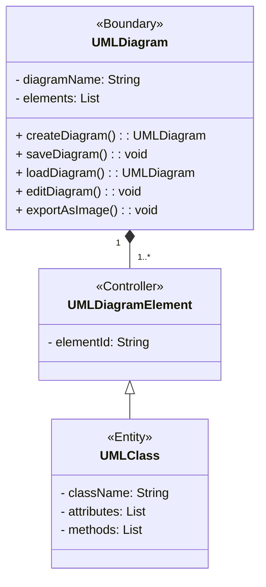
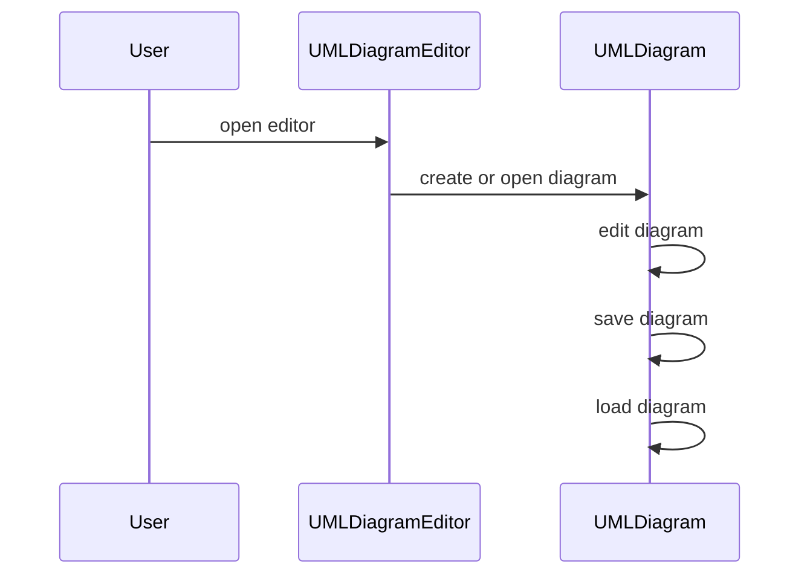
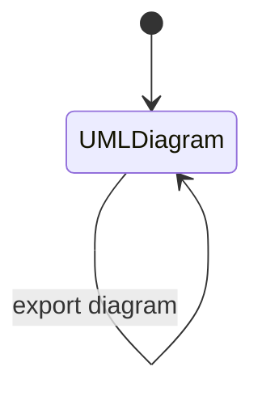

# Question 1

Using the b-c-e framework to develop the design of a simple UML editing software application.
Your answer should include the following:

• Design a set of 5 user stories that are specifically to this application. Note that your user stories must reflect the functionalities that are unique this kind of application. Generic user stories for normal software applications (e.g. log in, log out, create or edit account, registration, change password, etc.) will receive 0 mark.

• A flow of events for one selected use case from the above user stories. Again, note that generic use cases for normal software applications (e.g. log in, log out, create or edit account, registration, change password, etc.) will receive 0 mark.

• A class diagram to represent your design based on the above user stories.

• A communication diagram depicting the selected use case above.

• A UML state diagram to model the behaviour of an object in this system. You need to
clearly specify which object you model and your state diagram needs to have at least 5 states.
Your discussion must be specific to this case study. Generic answers copied from the lecture slides or other sources will be given 0 mark.

## a. User Stories

1. As a user, I want to be able to create a new UML diagram.
2. As a user, I want to be able to save my UML diagram.
3. As a user, I want to be able to load my UML diagram.
4. As a user, I want to be able to edit my UML diagram.
5. As a user, I want to be able to export my UML diagram as an image.

## b. Flow of Events

1. The user opens the UML diagram editor or design tool.
2. The user creates or opens an existing UML diagram.
3. The user reviews and ensures that the UML diagram is complete and ready for export.
4. The user looks for an option or menu that provides export functionality.
5. The user selects the export option, which may be labeled as "Export as Image" or similar.
6. A dialog box or prompt appears, allowing the user to specify the export settings.
7. The user chooses the desired image format for the export, such as PNG, JPEG, or SVG.
8. The user may have the option to customize other settings, such as image resolution or background color.
9. Once the export settings are configured, the user confirms the export by clicking on an "Export" or "Save" button.
10. The UML diagram editor processes the export request and generates the image file.
11. The image file is saved to the user's chosen location on their device or computer.
12. A confirmation message or notification is displayed, indicating that the export was successful.
13. The user can now access the exported UML diagram image and use it for their desired purposes.

## c. Class Diagram

## d. Communication Diagram

## e. State Diagram

# Question 2

Assume that you have a team of 6 people (namely Sheldon, Amy, Leonard, Penny, Howard and Raj), and apply a combination of Extreme Programming and DevOps to develop the above system in Question 1 in two months starting from today.

Describe how your team would organise and conduct validation and verification during the development of the above system. Your discussion must be specific to this case study (e.g. provide details, activities, timelines and examples that are specific to this team, their chosen methodologies, this system and this duration). Generic answers copied from the lecture slides or other sources will be given 0 mark.

Any assumptions which you have made should be stated clearly.

## Assumptions Made:

1. The team is familiar with Extreme Programming (XP) and DevOps methodologies.
2. The team has access to necessary development tools, version control systems, and testing frameworks.
3. The two-month duration is divided into four sprints of two weeks each, following XP's iteration structure.

Organizing and conducting validation and verification in the development of the above system using Extreme Programming (XP) and DevOps would involve the following activities, timeline, and examples:

1. Sprint Planning (Week 1, Day 1):

   Activity: Collaboratively define user stories for each sprint and prioritize them in the product backlog. \
   Timeline: Allocate the first day of the first week for sprint planning. \
   Example: Sheldon, Amy, Leonard, Penny, Howard, and Raj discuss and prioritize user stories like "Create a new UML diagram" and "Save UML diagram" based on their importance and dependencies.

2. Sprint Execution (Weeks 1-8):

   Activity: Implement the user stories selected for each sprint, following the XP practices of pair programming and continuous integration. \
   Timeline: Allocate two weeks per sprint for development and testing. \
   Example: Sheldon and Leonard work together as a pair to implement the "Create a new UML diagram" user story. They follow coding standards and perform regular code reviews to ensure code quality.

3. Unit Testing and Refactoring (Weeks 1-8):

   Activity: Write unit tests for individual components and perform refactoring to improve code quality. \
   Timeline: Conduct ongoing unit testing and refactoring throughout each sprint. \
   Example: Penny and Raj write unit tests for the "Save UML diagram" functionality using a testing framework. They also refactor code to improve readability and maintainability.

4. Integration Testing (Weeks 3-8):

   Activity: Integrate components developed by different team members and conduct integration testing. \
   Timeline: Allocate time in the third and subsequent sprints for integration testing. \
   Example: Howard integrates the "Create a new UML diagram" and "Save UML diagram" functionalities and performs integration testing to ensure they work together without issues.

5. System Testing (Weeks 5-8):

   Activity: Perform comprehensive testing on the entire system, including user interface, functionality, and performance. \
   Timeline: Allocate time in the fifth and subsequent sprints for system testing. \
   Example: Amy and Raj collaborate to create test scenarios that cover different use cases, ensuring that the UML diagram editor functions as expected.

6. User Acceptance Testing (Week 8):

   Activity: Collaborate with stakeholders or end-users to perform acceptance tests and gather feedback. \
   Timeline: Allocate the last week of the project for user acceptance testing. \
   Example: The team invites external stakeholders to test the UML diagram editor, gather feedback, and make necessary adjustments based on their input.

7. Continuous Deployment and Monitoring (Throughout the project):

   Activity: Use DevOps practices to continuously deploy the system to the production environment and monitor its performance and behavior. \
   Timeline: Implement continuous integration and continuous deployment from the beginning of the project. \
   Example: The team sets up an automated pipeline to build, test, and deploy the system to a staging environment for ongoing validation and verification.

# Question 3

Assume that you are asked to develop a software system which facilitates the recruitment process for HR managers, recruiters or hiring teams.\
Propose (and explain your reasons) a functionality of this software that can be developed using the data-driven approach discussed in the subject.\
What data should be collected and how to collect them to develop this functionality? What features should be extracted from the collected data and why?\
What are the ethical considerations specific to this functionality? Discuss how you would address them during the development and operation of the system.\
Your discussion must be specific to this case study. Generic answers copied from the lecture slides or any other sources will be given 0 mark.

## a. Functionality

1.
