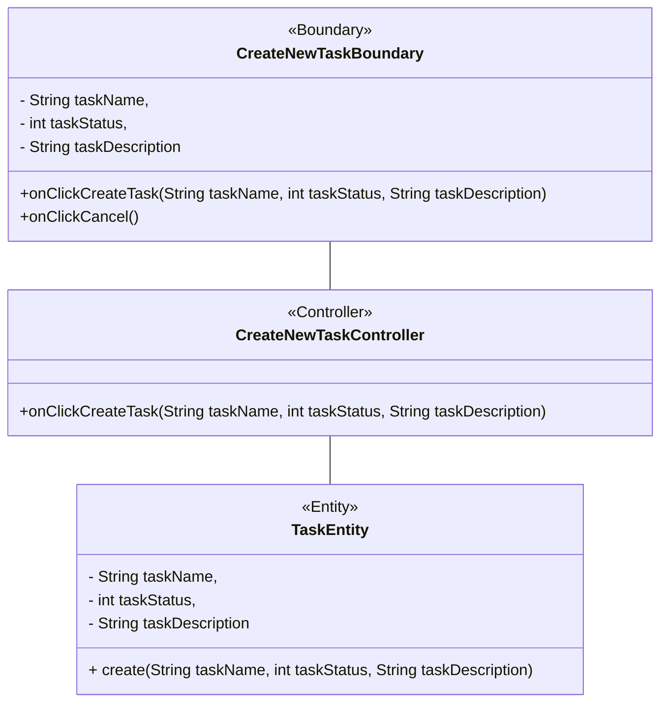
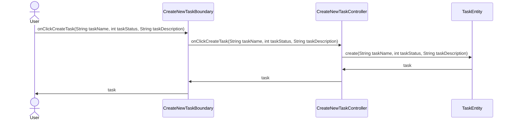
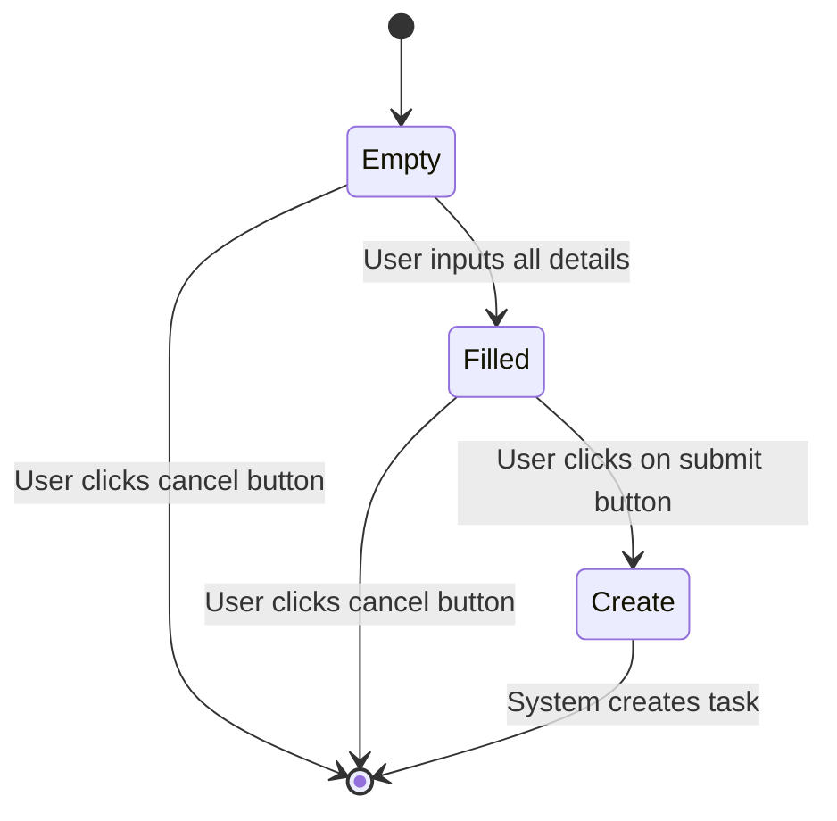

# Question 1

Using the b-c-e framework to develop the design of a software application which supports the Kanban software development process. Your answer should include the following:

- Design a set of 5 user stories that are specifically to this application. Note that your user stories must reflect the functionalities that are unique this kind of application. Generic user stories for normal software applications (e.g. log in, log out, create or edit account, registration, change password, etc.) will receive 0 mark.

- A flow of events for one selected use case from the above user stories. Again, note that generic use cases for normal software applications (e.g. log in, log out, create or edit account, registration, change password, etc.) will receive 0 mark.
- A class diagram to represent your design based on the above user stories.
- A sequence diagram depicting the selected use case above.
- A UML state diagram to model the behaviour of an object in this system. You need to clearly specify which object you model and your state diagram needs to have at least 5 states.

_Your discussion must be specific to this case study. Generic answers copied from the lecture slides or other sources will be given 0 mark._

## a. User stories:

1. As a user, I want to be able to create a new task, so that I can add it to my board.
2. As a user, I want to be able to edit a task, so that I can change its name, description, or status.
3. As a user, I want to be able to delete a task, so that I can remove it from my board.
4. As a user, I want to be able to create a new board, so that I can add tasks to it.
5. As a user, I want to be able to delete a board, so that I can remove it from my account.

## b. Use Case Description- Create a new task:

| Use Case Description        | Details                                                                                                                                                                                                                                                                                                                                                      |
| --------------------------- | ------------------------------------------------------------------------------------------------------------------------------------------------------------------------------------------------------------------------------------------------------------------------------------------------------------------------------------------------------------ |
| Name                        | Create a new task                                                                                                                                                                                                                                                                                                                                            |
| Stakeholders and goals      | User- create a new task                                                                                                                                                                                                                                                                                                                                      |
| Description                 | User wants to create a new task, so that they can add it to the board.                                                                                                                                                                                                                                                                                       |
| Actors                      | User                                                                                                                                                                                                                                                                                                                                                         |
| Trigger                     | User clicks on create new task button                                                                                                                                                                                                                                                                                                                        |
| Pre-condition               | User is logged in.                                                                                                                                                                                                                                                                                                                                           |
| Normal flow                 | <ol><li> User clicks on create new task button</li> <li>System displays a form for the user to fill in the details of the task.</li><li> User fills in the details of the task.</li><li> User clicks on the submit button.</li><li> System creates a new task and adds it to the board. </li><li>System displays new task creation success message</li></ol> |
| Sub flows                   | none                                                                                                                                                                                                                                                                                                                                                         |
| Alternate Exceptional flows | 1. User clicks on submit button without filling in the details of the task. System displays an error message.                                                                                                                                                                                                                                                |

## c. Class Diagram



## d. Sequence Diagram



## e. UML State Diagram

We are modelling the behaviour of a creating a new task from our user story chosen.\
The states are: Initial, Empty, Filled, Create, Final.\
_Assumptions made: Empty denotes that the object is in a null state, and Filled denotes that the object has been filled with the required details. Create denotes that the object has been created. Final denotes that the object has been created and the system has displayed a success message._



# Question 2

Describe and demonstrate how you would follow test-driven development to develop a class that has the following functionalities: (a) convert a given amount of money in AUD into SGD; (b) given two integer numbers x and y ranging from -10 to 10, calculate their sum of squares (i.e. x2 + y2); and (c) given a distance and the time taken a car to cover that distance, calculate its average speed.</br>

For each functionality, sketch 5 different unit test cases. Justify your choices of test cases.</br>

Your answer must be specific to this case study. Generic answers copied from the lecture slides or other sources will be given 0 mark.

## a. Test Cases for converting AUD to SGD

1. Test case 1: Minimum Conversion Value

```
Input: AUD 100
Expected Output: SGD 107.50
Description: This test case ensures that the conversion from AUD to SGD is accurate when given a valid input amount.
```

2. Test case 2: Maximum Conversion Value

```
Input: AUD 1
Expected Output: SGD 1.075
Description: This test case checks if the conversion function handles the smallest possible input value correctly.
```

3. Test case 3: Zero Conversion Value

```
Input: AUD 1,000,000
Expected Output: SGD 1,075,000
Description: This test case verifies if the conversion function correctly handles the maximum possible input value.
```

4. Test case 4: Invalid Currency

```
Input: AUD 0
Expected Output: SGD 0
Description: This test case ensures that the conversion function handles a zero input value appropriately.
```

5. Test case 5: Invalid Currency

```
Input: AUD 100, SGD
Expected Output: Error or Exception
Description: This test case checks if the conversion function correctly handles an invalid target currency and produces an error or exception.
```

## b. Test Cases for given two integer numbers x and y ranging from -10 to 10, calculate their sum of squares (i.e. x2 + y2);

1. Test case 1: Minimum Value

```
Input: x = -10, y = -10
Expected Output: 200
```

2. Test case 2: Maximum Value

```
Input: x = 10, y = 10
Expected Output: 200
```

3. Test case 3: Zero Value

```
Input: x = 0, y = 0
Expected Output: 0
```

4. Test case 4: Negative Value

```
Input: x = -10, y = 10
Expected Output: 200
```

5. Test case 5: Positive Value

```
Input: x = 10, y = -10
Expected Output: 200
```

## c. Test Cases for given a distance and the time taken a car to cover that distance, calculate its average speed.

1. Test case 1: Minimum Value

```
Input: distance = 1, time = 1
Expected Output: 1
```

2. Test case 2: Maximum Value

```
Input: distance = 100, time = 100
Expected Output: 1
```

3. Test case 3: Zero Value

```
Input: distance = 0, time = 0
Expected Output: Error or Exception
```

4. Test case 4: Negative Value

```
Input: distance = -1, time = -1
Expected Output: Error or Exception
```

5. Test case 5: Positive Value

```
Input: distance = 1, time = -1
Expected Output: Error or Exception
```

# Question 3

Assume that you have a team of 6 people. Describe how your team would apply Continuous Integration and Deployment (CI/CD) to develop the system in Question 1. Your discussion should include the following details:

1. The processes that you would setup for your team to follow.
2. The environments and tools that you would setup for your team and how you set them up.
3. How do you execute those processes and utilise those environments/tools, monitor them,
   and make adjustments if necessary?
4. How would your team address at least 4 of the eight laws of software evolution discussed in
   the subject?
